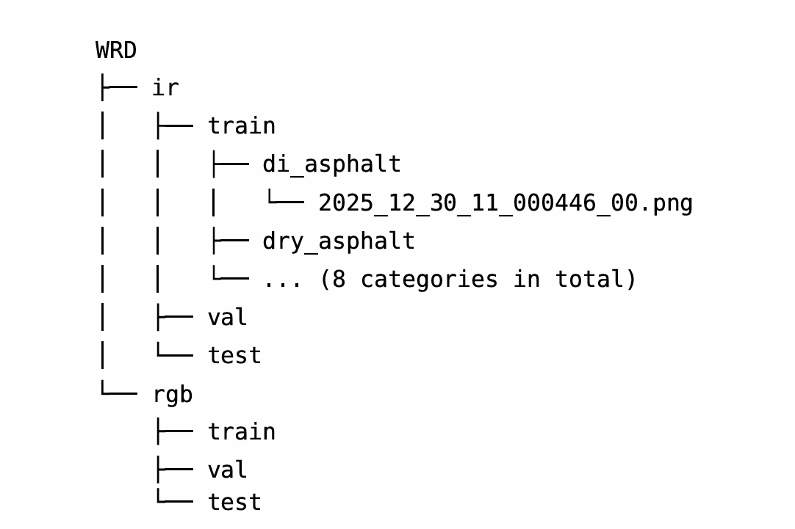

```markdown
<div align="right">
  <a href="README.md">English</a> | <strong>简体中文</strong>
</div>

<div align="right">
  <strong>English</strong> | <a href="README_zh-CN.md">简体中文</a>
</div>

# WRD-RGB-Thermal-Dataset


# 数据集简介

本项目使用的WRD数据集采集于中国哈尔滨，托管于[Zenodo](https://zenodo.org/records/19503581)。该数据集包含近20万个带标注的图像对，分为8个不同的类别。



为了方便使用这个双模态数据集，我们提供了一种基于双模态图像处理方法的方案, 基于 [MMPretrain](https://github.com/open-mmlab/mmpretrain)实现。 


# 环境设置


本项目基于 RTX 4090 显卡，运行于 Windows 11 系统。详细系统配置如下，建议最低配置为 GTX 1060 或更高配置。


```
Python	3.8.20
PyTorch	2.1.0 + cu118
TorchVision	0.16.0 + cu118
CUDA Runtime / Toolkit	11.8
cuDNN	8.7.0
NVCC	11.8.89
OpenCV	4.11.0
MMEngine	0.10.7
`


# 训练权重下载

所有模型权重都托管在 Hugging Face 上。您可以访问 [Hugging Face](https://huggingface.co/hitxiaoming/WRD-RGB-Thermal-Dataset-and-Models) 查看，或使用直接下载其中一个权重：

* [`sp_convnextv2.pth` (150 MB)](https://huggingface.co/hitxiaoming/WRD-RGB-Thermal-Dataset-and-Models/resolve/main/sp_convnextv2.pth?download=true)


## 运行训练/验证脚本

dual_stream_modules.py: 新增的脚本包含专为处理双模态数据输入而设计的特定处理方法和架构，适用于常见模型类型（CNN、Transformer 和hybrid），可以直接使用无需复杂的配置。

dual_stream_modulesxx.py: 本系列脚本包含针对特定网络架构设计的数据处理脚本，可以降低网络参数。

```
python train.py \ --config configs/sp_convnextv2.py \ --work-dir sp_convnextv2 
`

使用训练好的模型进行推理，以带有共享参数的 ConvNeXtV2 为例。

```
python val_demo.py 
`

## 引用

如果数据集对您有帮助，请引用:

> L. Mingwu, Y. Yunfei, L. Wantong, Z. Wanying, W. Jundong, and D. Zejiao. **WRD: RGB-IR dual-spectral dataset for road surface classification in severe winter**. Zenodo, 2026. doi:[10.5281/zenodo.19503581](https://doi.org/10.5281/zenodo.19503581).